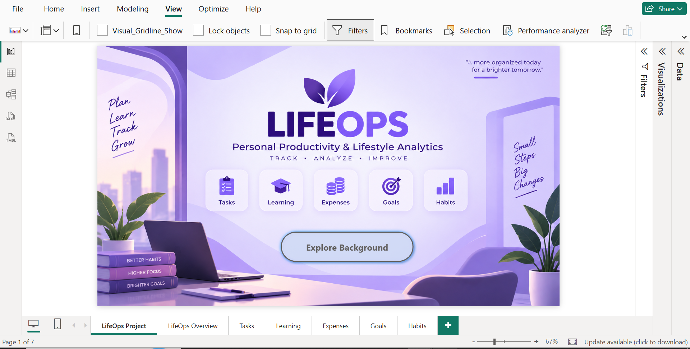
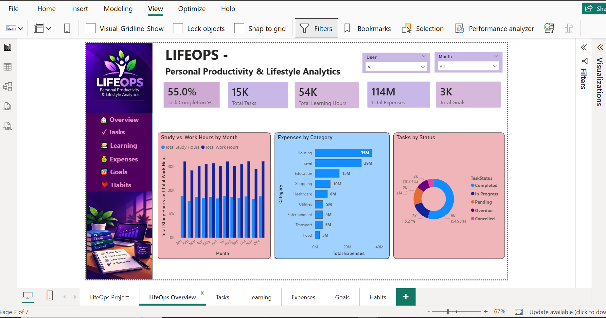
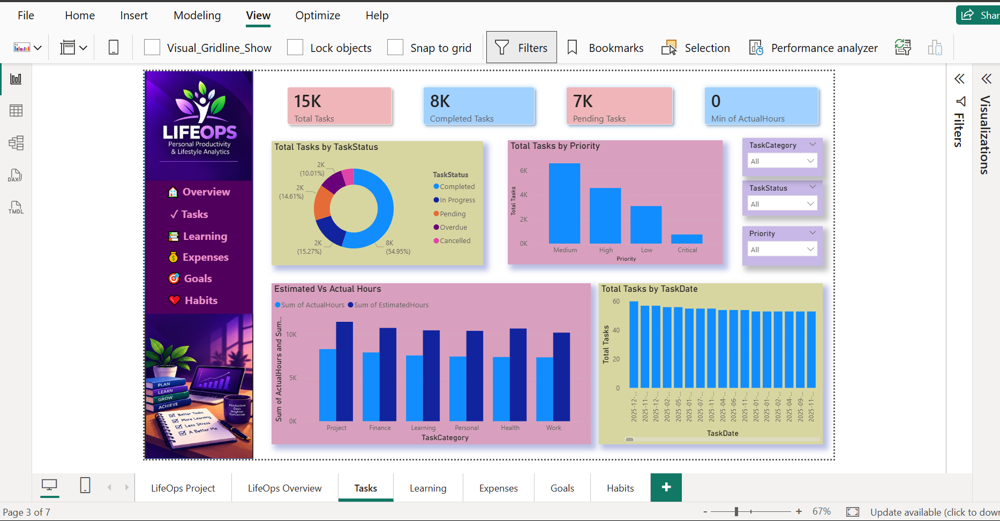
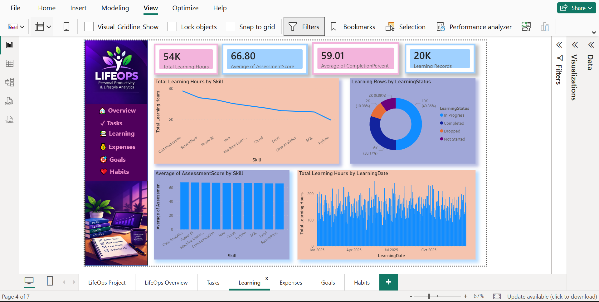
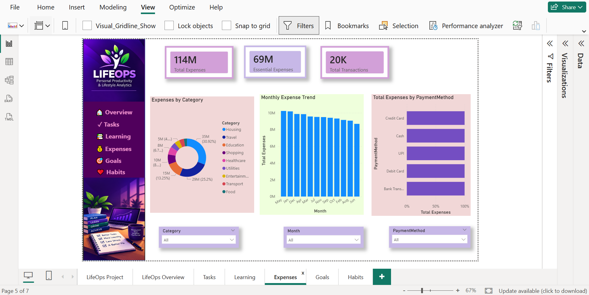
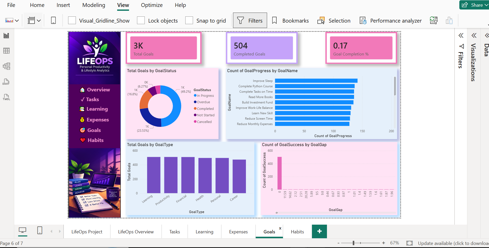
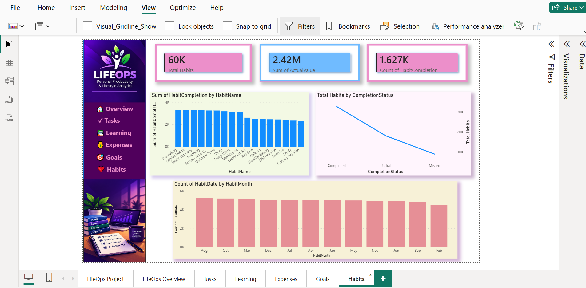

# 📊 LifeOps – Personal Productivity & Lifestyle Analytics Dashboard

## 📌 Project Overview

**LifeOps** is an interactive **Personal Productivity & Lifestyle Analytics Dashboard** developed using **Microsoft Power BI**.

The project brings multiple areas of personal productivity and lifestyle data into a single analytical solution, allowing users to explore patterns related to **tasks, learning, expenses, goals, habits, and daily activity**.

The final Power BI report contains a dedicated **Landing Page** followed by six analytical views:

- Overview
- Tasks
- Learning
- Expenses
- Goals
- Habits

The dashboard uses **Power Query, data modeling, DAX measures, KPI cards, interactive slicers, navigation, and visual analytics** to transform raw data into meaningful and easy-to-understand insights.

---

# 🖥️ Dashboard Preview

## Landing Page



## LifeOps Overview



---

# 🎯 Project Objective

The objective of LifeOps is to build an end-to-end analytics solution capable of analyzing different dimensions of productivity and lifestyle data within one Power BI report.

The dashboard is designed to support analysis of:

- Task workload and completion
- Estimated vs actual task effort
- Learning activity and performance
- Expense distribution and spending patterns
- Goal progress and completion
- Habit consistency and performance
- Study and work patterns
- Daily productivity indicators
- User and time-based trends

---

# 🛠️ Tools & Technologies

| Technology | Purpose |
|---|---|
| **Power BI** | Dashboard development and visualization |
| **Power Query** | Data cleaning and transformation |
| **DAX** | KPI and analytical measure creation |
| **SQL** | Data querying and analysis |
| **Python** | Synthetic dataset generation |
| **Excel** | Data exploration and analysis |
| **CSV** | Dataset storage |
| **GitHub** | Project documentation and portfolio hosting |

---

# 📊 Dataset

The LifeOps project uses **synthetic/generated data** created for learning, analytics, and portfolio demonstration.

Using synthetic data allows the project to demonstrate realistic analytical scenarios without exposing real personal information.

The project contains data for approximately **200 users** across several analytical areas.

| Dataset | Approximate Records | Purpose |
|---|---:|---|
| Users | 200 | User information and demographic attributes |
| Daily Activity | 73,000 | Daily work, study, sleep, exercise, leisure and productivity activity |
| Tasks | 15,000 | Task planning, status, priorities and effort |
| Expenses | 20,000 | Income and expense transactions |
| Goals | 3,000 | Personal and professional goal tracking |
| Learning | 10,000 | Learning activity and performance |
| Habits | 30,000 | Habit tracking and consistency |

---

# 🔄 Project Workflow

```text
Python Data Generation
        ↓
CSV Datasets
        ↓
Excel / SQL Analysis
        ↓
Power Query
        ↓
Data Cleaning & Transformation
        ↓
Power BI Data Modeling
        ↓
DAX Measures
        ↓
Interactive Dashboard Development
        ↓
Analysis & Visualization
```

---

# 📈 Dashboard Pages

## 1️⃣ Landing Page

The Landing Page acts as the entry point to the LifeOps dashboard.

It provides a consistent visual identity for the project and allows users to navigate into the analytical report.

### Features

- LifeOps branding
- Personal Productivity & Lifestyle Analytics theme
- Clean dashboard introduction
- Navigation to the analytical report
- Consistent purple visual theme


---

## 2️⃣ LifeOps Overview

The Overview page provides a high-level summary of the major areas covered by the LifeOps project.

### Key Analysis

- Overall productivity indicators
- Task-related KPIs
- Learning activity
- Expense information
- Goal information
- Study vs Work Hours
- Tasks by Status
- Expenses by Category
- User filtering
- Month/time filtering


---

## 3️⃣ Tasks Analytics

The Tasks dashboard provides detailed analysis of task workload, completion, priorities, categories, and time management.

### Key Analysis

- Total Tasks
- Completed Tasks
- Pending Tasks
- Task Completion %
- Tasks by Status
- Tasks by Category
- Task priority analysis
- Estimated vs Actual Hours
- Task trends
- Overdue task analysis



---

## 4️⃣ Learning Analytics

The Learning dashboard analyzes learning activities, skills, completion, and performance.

### Key Analysis

- Total Learning Hours
- Learning activity
- Learning Status
- Assessment Performance
- Completion Progress
- Skill Analysis
- Course Type Analysis
- Difficulty Level Analysis
- Learning Trends



---

## 5️⃣ Expense Analytics

The Expenses dashboard analyzes financial transactions and spending behavior.

### Key Analysis

- Total Expenses
- Total Transactions
- Essential Expenses
- Non-Essential Expenses
- Expenses by Category
- Monthly Expense Trend
- Spending patterns
- Payment methods
- Recurring expenses
- Essential vs Non-Essential spending



---

## 6️⃣ Goals Analytics

The Goals dashboard tracks progress across personal and professional goals.

### Key Analysis

- Total Goals
- Completed Goals
- Goal Completion %
- Goal Status
- Goal Type
- Goal Priority
- Target vs Current Progress
- Goal completion patterns



---

## 7️⃣ Habits Analytics

The Habits dashboard analyzes habit consistency, completion, and performance.

### Key Analysis

- Total Habits
- Completed Habits
- Habit Completion %
- Habit Categories
- Completion Status
- Actual vs Target Performance
- Habit streaks
- Habit trends over time



---

# 📐 Data Modeling

The Power BI model brings together multiple subject areas including:

- Users
- Daily Activity
- Tasks
- Expenses
- Goals
- Learning
- Habits
- Date information

The data model supports filtering and analysis across multiple dashboard pages.

A dedicated Date table is used to support time-based analysis.

The relationships between tables allow slicers and filters to dynamically update KPIs and visualizations throughout the report.

Detailed information about the project structure and datasets is available in the **Documentation** folder.

---

# 🧮 DAX & KPI Development

DAX measures are used throughout the project to calculate dynamic KPIs and analytical metrics.

One example is the Task Completion Percentage:

```DAX
Task Completion % =
DIVIDE(
    [Completed Tasks],
    [Total Tasks],
    0
)
```

Using `DIVIDE()` allows the calculation to safely handle situations where the denominator may be zero.

Other measures in the project support analysis across:

- Tasks
- Learning
- Expenses
- Goals
- Habits
- Daily Activity

These measures respond dynamically to filters and slicers in the report.

---

# ⚡ Power Query

Power Query is used as part of the Power BI data preparation workflow.

The transformation stage prepares the source datasets before they are used for data modeling and visualization.

The overall process includes:

- Loading source datasets
- Checking data types
- Preparing fields for analysis
- Transforming data where required
- Creating analysis-ready tables
- Loading prepared data into the Power BI model

---

# 🎛️ Dashboard Interactivity

LifeOps provides an interactive reporting experience through:

- Page navigation
- User slicers
- Month/time filters
- Cross-filtering between visuals
- KPI cards
- Interactive charts
- Category comparisons
- Status analysis
- Trend analysis
- Estimated vs Actual comparisons

Selections made through slicers dynamically update relevant visuals and KPIs.

---

# ✨ Key Dashboard Features

- Interactive multi-page Power BI report
- Dedicated landing page
- Six analytical dashboard views
- KPI cards
- Dynamic DAX measures
- Power Query transformations
- Data modeling
- User-based filtering
- Time-based filtering
- Cross-filtering
- Page navigation
- Trend analysis
- Category analysis
- Completion-rate analysis
- Estimated vs Actual analysis
- Consistent visual design

---

# 📁 Repository Structure

```text
LifeOps-PowerBI-Dashboard/
│
├── Data/
│   └── Project datasets
│
├── Documentation/
│   └── PROJECT_DOCUMENTATION.md
│
├── Excel/
│   └── LifeOps_Analytics.xlsx
│
├── PowerBi/
│   └── LifeOps Power BI Report (.pbix)
│
├── Screenshots/
│   ├── Landing_Page.PNG
│   ├── LifeOps_Overview.PNG
│   ├── Tasks.PNG
│   ├── Learning.PNG
│   ├── Expenses.PNG
│   ├── Goals.PNG
│   └── Habits.PNG
│
├── sql/
│   └── Project_LifeOps.sql
│
└── README.md
```

---

# 📚 Data Areas

## 👤 Users

Contains information used to identify and categorize users.

Example attributes include:

- User ID
- User Name
- Age Group
- Occupation
- City

---

## 📅 Daily Activity

Contains daily lifestyle and productivity information including:

- Study Hours
- Work Hours
- Deep Work Hours
- Meeting Hours
- Exercise Hours
- Leisure Hours
- Sleep Hours
- Productivity Score

---

## ✅ Tasks

Contains task-management information including:

- Task Category
- Priority
- Task Status
- Due Date
- Completion Date
- Estimated Hours
- Actual Hours
- Overdue Status

---

## 💰 Expenses

Contains financial transaction information including:

- Transaction Type
- Category
- Subcategory
- Amount
- Payment Method
- Recurring Status
- Essential / Non-Essential classification

---

## 🎯 Goals

Contains goal-management information including:

- Goal Type
- Goal Name
- Priority
- Target Value
- Current Value
- Deadline
- Goal Status

---

## 📖 Learning

Contains learning and skill-development information including:

- Skill
- Course Type
- Hours Spent
- Assessment Score
- Completion Percentage
- Learning Status
- Difficulty Level

---

## 🔁 Habits

Contains habit-tracking information including:

- Habit Name
- Habit Category
- Target Value
- Actual Value
- Completion Status
- Streak Days

---

# 💡 Analytical Capabilities

LifeOps demonstrates the ability to answer analytical questions such as:

- How many tasks are being completed?
- What percentage of tasks are completed?
- How does estimated task effort compare with actual effort?
- How are tasks distributed across different statuses?
- Which areas receive the most learning time?
- How does learning performance change over time?
- Which expense categories contribute most to overall spending?
- How does spending change month by month?
- What proportion of goals are completed?
- How are goals distributed across different types?
- How consistently are habits being completed?
- How do actual habit values compare with targets?
- How do study and work hours vary over time?

---

# 🧠 Skills Demonstrated

This project demonstrates practical experience with:

### Data Analytics

- Data Cleaning
- Data Transformation
- Exploratory Analysis
- KPI Development
- Trend Analysis
- Comparative Analysis

### Power BI

- Dashboard Development
- Power Query
- DAX
- Data Modeling
- Slicers
- Cross-filtering
- Page Navigation
- KPI Cards
- Interactive Visualizations

### Programming & Data

- Python
- SQL
- Excel
- CSV Data Processing

### Visualization

- Bar Charts
- Column Charts
- Line Charts
- Donut Charts
- Combo Charts
- KPI Cards
- Interactive Filters

---

# 📚 What I Learned

Through the LifeOps project, I gained hands-on experience in developing an end-to-end analytics solution.

The project strengthened my understanding of:

- Preparing datasets for analysis
- Working with multiple related data tables
- Using Power Query for data transformation
- Building a Power BI data model
- Creating reusable DAX measures
- Designing KPI-driven dashboards
- Selecting appropriate visualizations for analytical questions
- Implementing interactive slicers and filters
- Building multi-page Power BI reports
- Maintaining a consistent dashboard design
- Documenting an analytics project professionally using GitHub

---

# 📄 Project Documentation

Detailed technical documentation is available in:

```text
Documentation/PROJECT_DOCUMENTATION.md
```

The documentation includes:

- Project Overview
- Project Objective
- Technology Stack
- Dataset Information
- Data Dictionary
- Data Preparation
- Data Modeling
- DAX Measures
- Dashboard Pages
- Project Workflow
- Skills Demonstrated

---

# 🚀 How to View the Project

### Option 1 – View Screenshots

All dashboard screenshots are available in the:

```text
Screenshots/
```

folder.

### Option 2 – Open the Power BI Report

1. Download the `.pbix` file from the `PowerBi` folder.
2. Install or open **Microsoft Power BI Desktop**.
3. Open the LifeOps `.pbix` file.
4. Use the landing page to navigate through the report.
5. Explore the dashboard using the available slicers and filters.

---

# 🔮 Future Improvements

Possible future enhancements include:

- Additional advanced DAX measures
- Drill-through analysis
- Tooltip pages
- More detailed user segmentation
- Advanced productivity scoring
- Additional time-intelligence analysis
- Automated data refresh
- Power BI Service deployment

---

# 👩‍💻 Author

## Mangali Tejasree

**B.Tech – Computer Science Engineering | 2026**

Interested in:

- Data Analytics
- Power BI
- SQL
- Python
- Business Intelligence
- Data Visualization

---

## ⭐ Project Summary

**LifeOps** demonstrates an end-to-end data analytics workflow covering:

**Python → CSV → Excel/SQL → Power Query → Data Modeling → DAX → Power BI → Interactive Dashboard → GitHub Documentation**

The project was developed as a portfolio project to demonstrate practical skills in **data preparation, analysis, visualization, dashboard development, and business intelligence**.

---

⭐ **Thank you for exploring the LifeOps Power BI Dashboard!**
